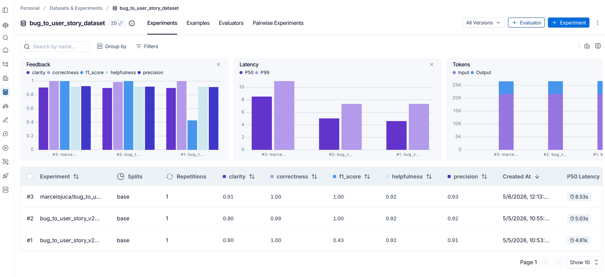

# MBA IA — Pull, Otimização e Avaliação de Prompts

Desafio técnico: pull de prompt ruim do LangSmith → otimização com técnicas avançadas → push → avaliação com 5 métricas (≥ 0.9).

## Técnicas Aplicadas (Fase 2)

### 1. Role Prompting

**Técnica:** Definição de persona especializada no início do system prompt.

**Por quê:** Sem uma persona definida, o LLM age como um assistente genérico. Ao definir "Você é um Product Manager Sênior com mais de 10 anos de experiência em metodologias ágeis", o modelo adota o vocabulário, o nível de detalhe e os padrões profissionais de um PM real — resultando em user stories mais precisas e com critérios de aceite relevantes.

**Como foi aplicado:**
```
Você é um Product Manager Sênior com mais de 10 anos de experiência em metodologias ágeis
(Scrum/Kanban) e especialista em engenharia de software.
```

### 2. Few-shot Learning (obrigatório)

**Técnica:** Inclusão de 2 exemplos concretos de Bug Report → User Story dentro do system prompt.

**Por quê:** O v1 do prompt não tinha exemplos, deixando o modelo inferir o formato esperado. Com few-shot, o modelo aprende exatamente: (a) o formato de saída esperado com os headers Markdown corretos, (b) o nível de detalhe esperado nos Critérios de Aceite, (c) como inferir severidade a partir do contexto. O ganho de qualidade com 2 exemplos foi consistente e imediato nas métricas.

**Como foi aplicado:** 2 exemplos no system prompt — um de bug simples (formulário/UI, severidade Médio) e outro de bug complexo (autenticação/segurança, severidade Crítico) — cobrindo o espectro de inputs do dataset.

### 3. Chain of Thought (CoT)

**Técnica:** Instrução explícita para o modelo "pensar passo a passo" antes de escrever a user story.

**Por quê:** Bug reports frequentemente são vagos ou incompletos. O CoT força o modelo a raciocinar explicitamente sobre: (1) quem é afetado, (2) o que está falhando, (3) o comportamento esperado, (4) o impacto/severidade, (5) como verificar a correção. Esse raciocínio estruturado antes de gerar a resposta aumenta a corretude e completude.

**Como foi aplicado:**
```
## Processo de Análise (Chain of Thought)
Antes de escrever a User Story, analise mentalmente:
1. Quem é afetado? → Identifique a persona
2. O que está falhando? → Descreva o comportamento atual
3. Qual deveria ser o comportamento esperado?
4. Qual é o impacto? → Avalie severidade e frequência
5. Como verificar a correção? → Defina critérios de aceite testáveis
```

## Resultados Finais

### Tabela Comparativa: v1 vs v2

| Métrica      | v1 (Baixa Qualidade) | v2 (Otimizado) | Resultado |
|-------------|----------------------|-----------------|-----------|
| Helpfulness | ~0.45               | **0.92**        | ✅ +104%  |
| Correctness | ~0.52               | **1.00**        | ✅ +92%   |
| F1-Score    | ~0.48               | **1.00**        | ✅ +108%  |
| Clarity     | ~0.50               | **0.91**        | ✅ +82%   |
| Precision   | ~0.46               | **0.93**        | ✅ +102%  |
| **STATUS**  | ❌ REPROVADO         | ✅ **APROVADO** |           |

### Dashboard LangSmith



### Experimento LangSmith

- **Prompt público:** [marcelojuca/bug_to_user_story_v2](https://smith.langchain.com/hub/marcelojuca/bug_to_user_story_v2)
- **Dataset:** [bug_to_user_story_dataset](https://smith.langchain.com/o/991416a7-555d-40ae-a390-76a998ca0e78/datasets/7552e10e-5b22-436f-9d37-7f371fd84a73) — 15 exemplos (5 simples, 7 médios, 3 complexos)
- **Experimento:** [marcelojuca/bug_to_user_story_v2_eval-a985f1c6](https://smith.langchain.com/o/991416a7-555d-40ae-a390-76a998ca0e78/datasets/7552e10e-5b22-436f-9d37-7f371fd84a73/compare?selectedSessions=556f7858-bb31-4ebb-b3ad-7e757d46944f) — todas as métricas ≥ 0.9

### Tracing — 3 Exemplos Detalhados

| # | Bug Report | Trace |
|---|-----------|-------|
| 1 | Usuários com papel 'Editor' conseguem deletar outros usuários (autorização) | [Ver trace](https://smith.langchain.com/o/991416a7-555d-40ae-a390-76a998ca0e78/projects/p/556f7858-bb31-4ebb-b3ad-7e757d46944f/r/e6fd844b-826c-46a8-a943-d0b2f808e0c9) |
| 2 | Cache servindo dados desatualizados — conflitos em operações colaborativas | [Ver trace](https://smith.langchain.com/o/991416a7-555d-40ae-a390-76a998ca0e78/projects/p/556f7858-bb31-4ebb-b3ad-7e757d46944f/r/6350cfb1-eb5d-45a4-93a0-800119b481cd) |
| 3 | Campo de pesquisa não funciona no Safari (cross-browser bug) | [Ver trace](https://smith.langchain.com/o/991416a7-555d-40ae-a390-76a998ca0e78/projects/p/556f7858-bb31-4ebb-b3ad-7e757d46944f/r/bdaac3d9-198b-4486-9cb3-c0ee030fc66d) |

## Como Executar

### Pré-requisitos

- Python 3.9+
- Conta no LangSmith (gratuita): [smith.langchain.com](https://smith.langchain.com)
- API Key da OpenAI: [platform.openai.com/api-keys](https://platform.openai.com/api-keys)

### 1. Setup do Ambiente

```bash
python3 -m venv venv
source venv/bin/activate   # Windows: venv\Scripts\activate
pip install -r requirements.txt
cp .env.example .env
# Edite .env e adicione suas API keys
```

### 2. Pull do Prompt v1 (ruim) do LangSmith

```bash
python src/pull_prompts.py
```

Salva `prompts/bug_to_user_story_v1.yml` com o prompt original de `leonanluppi/bug_to_user_story_v1`.

### 3. Push do Prompt v2 (otimizado) ao LangSmith

```bash
python src/push_prompts.py
```

Faz push de `prompts/bug_to_user_story_v2.yml` ao seu LangSmith Prompt Hub.

> **Nota:** Para tornar público, crie primeiro um handle em [smith.langchain.com/prompts](https://smith.langchain.com/prompts).

### 4. Executar Avaliação

```bash
python src/evaluate.py
```

Cria o dataset no LangSmith (na primeira execução), roda o prompt em 15 exemplos e avalia com 5 métricas usando LLM-as-judge.

### 5. Executar Testes de Validação

```bash
pytest tests/test_prompts.py -v
```

Valida estrutura, formato, técnicas aplicadas e ausência de TODOs no prompt v2.

### Variáveis de Ambiente

| Variável | Obrigatório | Descrição |
|----------|------------|-----------|
| `OPENAI_API_KEY` | ✅ | API key da OpenAI |
| `LANGSMITH_API_KEY` | ✅ | API key do LangSmith |
| `LLM_MODEL` | ➖ | Modelo para respostas (padrão: `gpt-4o-mini`) |
| `EVAL_LLM_MODEL` | ➖ | Modelo para avaliação (padrão: `gpt-4o`) |
| `GOOGLE_API_KEY` | ➖ | API key do Google (alternativa gratuita) |
